  

# ✈️ Awesome Air Cargo Management

  
  
  
  
  

## 🚀 Top Air Cargo Management Ecosystem & Digital Logistics Tech

> **Curated List of Enterprise SaaS Platforms & Open-Source GitHub Projects for Air Freight Booking, Cargo Airline Systems, AWB/e-AWB, Capacity Management, Cargo-IMP / IATA ONE Record Messaging & Air Cargo Logistics Software.**

📅 **Last updated: September 2026**

---

### 💡 Overview & SEO Keyword Guide
Welcome to the premier curated directory for **Air Cargo Management Systems (ACMS)**, **Transportation Management Systems (TMS)**, and **Air Freight Software**. This repository tracks notable enterprise **SaaS platforms** and **open-source projects** for airline cargo handling, GSA operations, electronic air waybill (e-AWB) processing, revenue management, dynamic capacity booking, and modern standard data exchange (such as **IATA ONE Record** and **Cargo-IMP / Cargo-XML**).

---

## 📑 Table of Contents
- [🏢 SaaS & Enterprise Hosted Platforms](#-saas--enterprise-hosted-platforms)
- [🔓 Open-Source GitHub Projects & Data Standards](#-open-source-github-projects--data-standards)
- [🤝 How to Contribute](#-how-to-contribute)
- [💖 Support & Sponsorship](#-support--sponsorship)
- [⚠️ Disclaimer](#%EF%B8%8F-disclaimer)
- [📈 Star History](#-star-history)

---

## 🏢 SaaS & Enterprise Hosted Platforms

The global **Air Cargo Management Software** market is estimated at **$1.8 Billion to $2.2 Billion USD** and is expected to grow at a CAGR of ~6.8%. The sector is **moderately fragmented**, balancing dominant enterprise logistics suites (e.g., WiseTech CargoWise, Descartes Systems Group, IBS Software) for core infrastructure with specialized digital booking, revenue management, and e-AWB point solutions (e.g., CargoAi, Wiremind Cargo, Awery) innovating across niche operational segments.

| Product / Platform | Company Size (Revenue / Valuation) | Pricing (Starting Tier) | Free Tier Limit / Free Trial | Key Capabilities & Description |
| :--- | :--- | :--- | :--- | :--- |
| **[Unisys Cargo Core / Portal](https://www.unisys.com/)** | ~$2.01B USD Total Corp Revenue / ~$350M USD Market Cap | ~$15,000 USD/month enterprise hosting & core platform maintenance base tier | No free tier; 30-day proof-of-concept (POC) available for enterprise airline evaluations | Airline cargo management software covering booking, operational handling, customs, and community logistics integration. |
| **[WiseTech CargoWise](https://www.wisetechglobal.com/)** | ~$1.4B AUD (~$930M USD) Annual Revenue / ~$10.8B AUD (~$7.2B USD) Market Cap | ~$19.95 USD per import container transaction / ~$9.95 USD per standalone customs entry under CargoWise Value Pack (CVP) model | No free tier or trial; demo available upon request; free online learning via WiseTech Academy | Global logistics platform with comprehensive air freight modules for forwarders—quoting, booking, e-AWB, and multi-modal operations. |
| **[Descartes Air Messaging](https://www.descartes.com/)** | ~$651M USD Annual Revenue / ~$6.61B USD Market Cap | ~$500 USD/month starter messaging integration package (plus volume-based per-message transmission fees) | No free tier; 14-day evaluation demo offered upon request for cargo carrier connectivity testing | Air messaging and e-AWB solution enabling connectivity between freight forwarders, airlines, and customs authorities. |
| **[Awery Aviation Software](https://awery.aero/)** | ~$250M - $500M USD Est. Revenue | ~$850 USD/month base module subscription for small air cargo operators | 15-day free trial available for Awery ERP and Awery Documents Library | Comprehensive aviation ERP and cargo management software covering flight ops, charter booking, and e-AWB workflows. |
| **[IBS iCargo](https://www.ibsplc.com/)** | ~$188M USD Est. Revenue / ~$2.0B USD Target Valuation | ~$12,000 USD/month enterprise base tier for regional airline operations | No free tier; 30-day enterprise demo/sandbox environment available for prospective airline clients | Comprehensive air cargo management suite used by major airlines for booking, cargo handling, revenue accounting, and GSA ops. |
| **[CHAMP Cargosystems](https://www.champ.aero/)** | ~$86.6M USD Est. Revenue | ~$2,500 USD/month base operational subscription for regional carriers (Cargospot suite) | No free tier or trial; guided demo available upon request via official sales portal | End-to-end air cargo IT provider offering airline cargo management (Cargospot), e-AWB messaging, and community integration platforms. |
| **[SmartKargo](https://www.smartkargo.com/)** | ~$33.5M USD Est. Revenue | ~$1,200 USD/month starter module fee (plus per-shipment processing charges) | No free tier; 30-day interactive demo setup provided for airline cargo team evaluations | Cloud-native air cargo solution leveraging AI for dynamic pricing, capacity management, e-commerce integration, and revenue optimization. |
| **[RapidCargo](https://www.rapidcargo.com/)** | ~$11M - $100M USD Est. Revenue | ~$150 USD per shipment rate quote base tier for international air freight legs | No free tier or trial; rate quotes and trial shipments available via sales consultation | Operational freight forwarding and air cargo handling platform serving regional trade lanes and freight logistics. |
| **[Wiremind Cargo](https://www.wiremind.io/cargo/)** | ~$10M - $14M USD Est. Revenue | ~$1,500 USD/month base tier for CARGOSTACK CMS revenue management module | No free tier; 14-day customized Proof of Concept (POC) demonstration available using client historical data | Advanced AI-driven capacity optimization, revenue management (CAYZN Cargo), and ULD rate management for air cargo carriers. |
| **[CargoAi](https://cargoai.co/)** | ~$5M - $10M USD Est. Revenue | €169 EUR/month (Pro plan, billed annually) | Free tier available (CargoMART plan with live capacity, basic rates, and booking with 115+ airlines subject to fair-use rate limits) | Digital air cargo marketplace connecting freight forwarders and airlines with real-time rate search, e-booking, and tracking. |

---

## 🔓 Open-Source GitHub Projects & Data Standards

Production air cargo airline systems are predominantly commercial, but open-source software plays a pivotal role in **data standardization (IATA ONE Record)**, **customs & message conversion (Cargo-XML / Cargo-IMP)**, **open TMS engines**, and **educational booking state machines**. 

*Repos are sorted below by GitHub Stars_Count (descending).*

1. **[IATA-Cargo/ONE-Record](https://github.com/IATA-Cargo/ONE-Record)**   
   📦 Official IATA repository containing the standard specification, ontology schemas, API definitions, and data models for **IATA ONE Record** digital air freight data exchange.

2. **[loadpartner/tms](https://github.com/loadpartner/tms)**   
   🚚 Open-source Transportation Management System (TMS) designed for freight brokers and logistics operations, adaptable for multi-modal air freight dispatch.

3. **[IATA-Cargo/one-record-server-java](https://github.com/IATA-Cargo/one-record-server-java)**   
   ☕ Official reference Java implementation of an IATA ONE Record server API for publishing and subscribing to digital air cargo logistics objects.

4. **[digital-cargo/good-practice-shipment-tracking](https://github.com/digital-cargo/good-practice-shipment-tracking)**   
   📊 Reference implementation and operational guidance for implementing standardized shipment tracking within the IATA ONE Record digital cargo network.

5. **[DrPhilippBillion/1R_ShipmentTracking](https://github.com/DrPhilippBillion/1R_ShipmentTracking)**   
   🌐 Open implementation and API schema requirements for ONE Record shipment tracking interoperability across carrier networks.

6. **[IATA-Cargo/one-record-security-java](https://github.com/IATA-Cargo/one-record-security-java)**   
   🔒 Reference Java security framework demonstrating mutual authentication, authorization, and data privacy compliance for ONE Record servers.

7. **[riege/one-record-converter](https://github.com/riege/one-record-converter)**   
   🔄 Open converter utility for transforming legacy Cargo-XML messages (e.g., XFWB / XFZB) into modern IATA ONE Record JSON-LD formats.

8. **[open-logistics-foundation/ne-one](https://git.openlogisticsfoundation.org/digital-air-cargo/ne-one)**   
   ⚡ Open-source reference server implementation (NE:ONE) developed by Fraunhofer IML for deploying production-ready IATA ONE Record node services.

9. **[wearewarp/warp-tools](https://github.com/wearewarp/warp-tools)**   
   🛠️ Self-hosted operational tools for carrier management, rate lookup, and shipment invoicing designed to replace manual spreadsheet workflows.

10. **[freightcms/freightcms](https://github.com/freightcms/freightcms)**   
    🏗️ Cloud-native containerized cargo management project tailored for self-hosted logistics dispatch and freight workflows.

---

### 🧩 Key Building Blocks for Custom Air Freight Systems
* **Industry Data Standard**: IATA ONE Record & NE:ONE serve as the global open standard foundation for digital shipment data exchange.
* **Forwarder & Broker TMS**: Open TMS repositories provide flexible building blocks for rate management and multi-modal shipment booking.
* **Converters & Adapters**: Libraries like `one-record-converter` assist legacy systems in transitioning from Cargo-IMP/Cargo-XML to JSON-LD interfaces.

---

## 🤝 How to Contribute

Contributions from the air freight and software engineering community are warmly welcomed!

1. **Fork** the repository 🍴
2. **Add or edit** entries in `README.md` (ensure data is accurate and factual)
3. **Include**: Product name, website link, 1–2 sentence description, pricing/trial details, and revenue/star metrics
4. **Submit a Pull Request** with a clear title and description 🚀

---

## 💖 Support & Sponsorship

Thank you for exploring **Awesome Air Cargo Management**! If this repository helped you discover logistics platforms, learn about IATA ONE Record, or build air freight software:

- ⭐ **Star this repository** to help others discover it!
- 🍴 **Fork it** to customize your own software directory.
- 📣 **Share it** with fellow aviation and supply chain developers!
- ☕ **Buy me a coffee / Sponsor**: If you'd like to support open-source logistics research and maintenance, visit the [GitHub Sponsor Dashboard](https://github.com/sponsors/ishandutta2007).

---

## ⚠️ Disclaimer

- This is a **community-curated** educational directory and does not constitute formal commercial endorsement.
- Air cargo systems process regulated trade, customs compliance, and safety-critical data. Always verify compliance with IATA regulations, local aviation authorities, and security standards before deploying software in live airline operations.

---

## 📈 Star History

---

  <b>Made with ❤️ for Airline Cargo Teams, Freight Forwarders, GSAs, and Logistics Software Engineers worldwide.</b>

